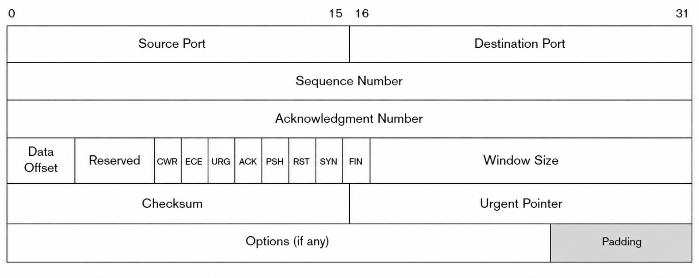
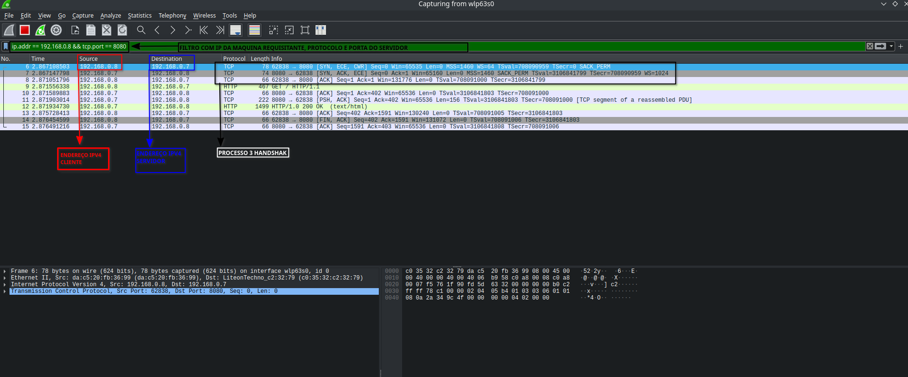

# Análise do Handshake TCP com Wireshark

## Objetivo

Analisar o processo de estabelecimento de conexão TCP através da captura e inspeção de pacotes utilizando Wireshark.

## Introdução 
O "Three-Way handshak" é o procedimento estabelecido no modelo TCP/IP e usado para estabelecer um conexão. Este procedimento é normalmente iniciado por um par TCP e respondido por outro par do TCP.
Documentação RFC 9293 (https://www.rfc-editor.org/info/rfc9293/#name-establishing-a-connection)

## Exemplo de cabeçalho TCP

## Tecnologias Utilizadas

- Python
- Linux
- Wireshark
- TCP/IP

## Ambiente de Testes

Servidor:
- Python HTTP Server
- IP: 192.168.0.7 
- PORTA: 8080

Cliente:
- Smartphone iOS
-IP: 192.168.0.8

## Captura de Tráfego

Foi utilizado o Wireshark para monitorar o tráfego entre cliente e servidor, com filtros de ip de origem protocolo e porta para facilitar a visualização.
FIltro utilizado:`ip.addr == 192.168.0.8 && tcp.port == 8080`

## Análise do Three-Way Handshake

### Análise do SYN
O cliente inicia a conexão enviando um pacote TCP com a flag SYN (Synchronize) ativada. Nesse pacote, ele informa seu número inicial de sequência (Sequence Number) e solicita o estabelecimento da comunicação com o servidor.

### Análise do SYN-ACK
Ao receber o SYN, o servidor responde com um pacote contendo as flags SYN e ACK (Acknowledgment) ativadas. O servidor envia seu próprio número inicial de sequência e confirma o recebimento do SYN do cliente.

### Análise do ACK
O cliente finaliza o processo enviando um pacote com a flag ACK ativada. Esse pacote confirma o recebimento da resposta do servidor, concluindo o estabelecimento da conexão TCP.

## Conclusão

A realização deste experimento permitiu observar, na prática, o funcionamento do processo de estabelecimento de conexão do protocolo TCP, conhecido como Three-Way Handshake. Por meio da captura e análise dos pacotes utilizando o Wireshark, foi possível identificar as etapas SYN, SYN-ACK e ACK, compreendendo como cliente e servidor sincronizam seus números de sequência antes do início da transmissão de dados.

A utilização de um servidor HTTP desenvolvido em Python possibilitou a geração controlada de tráfego de rede, facilitando a observação do comportamento do protocolo em um cenário real. Além disso, a aplicação de filtros no Wireshark permitiu isolar os pacotes relevantes para a análise, tornando o processo de investigação mais eficiente.

Este projeto contribuiu para o aprofundamento dos conhecimentos em redes de computadores, protocolos TCP/IP e análise de tráfego, demonstrando na prática conceitos fundamentais utilizados em atividades de administração de redes, monitoramento e cibersegurança.
